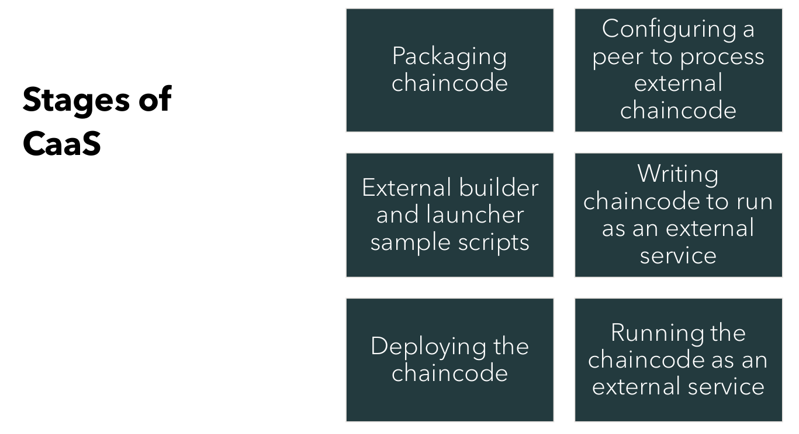

# External Chaincode

- Users can manage a chaincode runtime independently of the peer.
- This facilitates deployment of chaincode on Fabric cloud deployments such as Kubernetes.
- Instead of building and launching the chaincode on every peer, chaincode can now run as a service whose lifecycle is managed outside of Fabric.
- This capability leverages the Fabric v2.0 external builder and launcher functionality which enables operators to extend a peer with programs to build, launch, and discover chaincode.





## No Official Image Support

- This is an advanced feature that will likely require custom
  packaging of the peer image.

- For example, the following samples use jq and bash, which
  are not included in the current official fabric-peer image.

## Enabling TLS communication between chaincode and peer

-  Set tls_required parameter to true in connection.json file
-  Generate tls certs for chaincode 
```
$ openssl req -nodes -x509 -newkey rsa:4096 -keyout crypto/key1.pem -out crypto/cert1.pem -subj "/C=IN/ST=KA/L=Bangalore/O=example Inc/OU=Developer/CN=asset-transfer-basic.hlf1/emailAddress=dev@asset-transfer-basic.hlf1"
``` 
- Use cert1.pem as string for root_cert parameter in connection.json 
```
$ awk 'NF {sub(/\r/, ""); printf "%s\\n",$0;}' crypto/cert1.pem

```
- Mount tls certs as k8s secrets in chaincode container, find reference below

> Note: the steps provided below and their explainations refered to tha sample provided in this repository at `Hyperledger-Fabric-on-Azure-Kubernetes-Cluster/chaincode-samples/asset-transfer-basic/chaincode-external`
## Packaging Chaincode


- With the Fabric v2.0 chaincode lifecycle, chaincode is packaged and installed in a .tar.tgz 
  format.
- The following asset-transfer-basic-external.tgz archive demonstrates the required structure:

```
$ cd <rootDir>/Hyperledger-Fabric-on-Azure-Kubernetes-Cluster/chaincode-samples/asset-transfer-basic/chaincode-external/
$ tar cfz code.tar.gz connection.json
$ tar cfz asset-transfer-basic-external.tgz metadata.json code.tar.gz
```
>   Note: Fabric cli should be initialized

## File code.tar.gz

- External chaincode uses connection.json and metadata.json files.

- Connection.json will have things like address of the chaincode, port etc.
- Metadata will have type and label of chaincode, type has to be external in order to use CaaS.

- Connection.json is filled with information first ,we package this and create tar.


## Installing the external chaincode
### Overview of the process followed :
- Create docker image of chaincode.
- Deploy chaincode on cluster.
- Package the chaincode and install to get peer identifier.
- Run chaincode using identifier.
- Certs and key are needed, mount them to container.
- Once its deployed and running, we approve chaincode.
- The containerized external chaincode image will be executing independently as per our process overview. This provides additional security while executing chaincode in HLF.
```
$ $FABRIC_EXECUTABLE_PATH lifecycle install basic <path-to-package>/asset-transfer-basic-external.tgz

```

 ## Kubernetes operations for deploying chaincode
```
$ kubectl create ns hlf1
$ kubectl create secret generic cc-cert --from-file=cert1.pem -n hlf1
$ kubectl create secret generic cc-key --from-file=key1.pem -n hlf1
$ kubectl apply -f asset-transfer-basic.yaml (Add chaincode Identifier in manisfest file)

```
> Note: Go through environment variables in asset-transfer-basic.yaml, tls certs and k8s secrets for chaincode is created using openssl in crypto folder

## Chaincode Approval and Commit

```
$ $FABRIC_EXECUTABLE_PATH lifecycle approve basic v1 basics_1.0:307a3baf76dce88bf3a943fd540e659c76c34b2e3998cd03148ca3714fc60246  1 --policy "OR('kcpeer.member')"

$ $FABRIC_EXECUTABLE_PATH lifecycle commit basic v1 1 --policy "OR('kcpeer.member')"


```
## Chaincode Invoke and Query

```
$ $FABRIC_EXECUTABLE_PATH  chaincode invoke basic --fcn InitLedger --args []

$ $FABRIC_EXECUTABLE_PATH  chaincode query basic --fcn GetAllAssets  --args []

```

>   Note: Chaincode is deployed in peer's cluster in this example.


